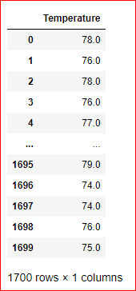
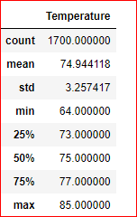
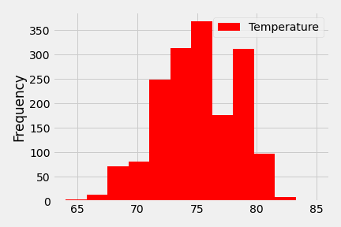
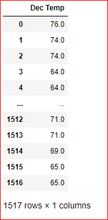
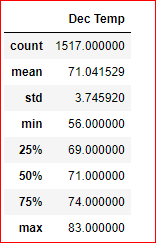
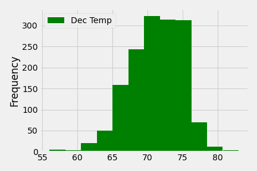
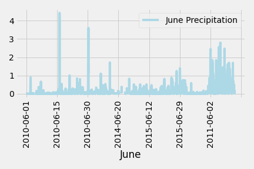
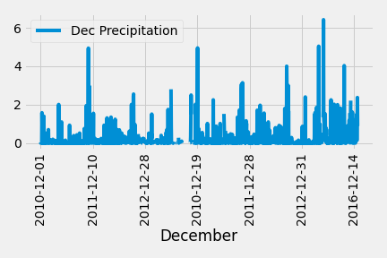

# Temperature Data for the month of JUNE & DECEMBER

## Determine the Summary Statistics for June:
* Wrote a query to retrieve all the temperature in the month of  June.
* Filtered it by date from Measurement table.
* Converted the June temperatures to a list.

* Created DataFrame from the list of tempertures for the month of June.
* Using the describe function, got the summary of statistics. 

* Using the plot function , created histogram of the frequency and the temperature.

## Determine the Summary Statistics for December
* Wrote a query to retrieve all the temperature in the month of  December.
* Filtered it by date from Measurement table.
* Converted the December temperatures to a list.

* Created DataFrame from the list of tempertures for the month of December.
* Using the describe function, got the summary of statistics. 

* Using the plot function , created histogram of the frequency and the temperature.

## Result

 

1. The mean temperature for June is 75 degrees compared to 71 degree in December.
2. The minumum temperature in the month of June is64 comapred to 56 degree in December.
3. The maximum temperture for June is 85 compared to 83 in December.

## Summary 

* Overall June is warmer compared to December. The sale of ice cream store may be higher in June. 

* Created the precipitation chart for the month of June and December from the measurement table. 

* The precipitation chart for June: 

* The precipitation chart for December:

The precipitaion in was higher in the December month compared to June with the given data.

